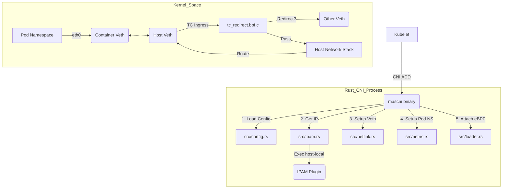

# Rust CNI + eBPF 架构与源码深度解析

这份文档旨在帮助你在开始 Phase 3 之前，完全理解目前的 **Rust CNI (Phase 2)** 实现逻辑。

## 1. 核心架构图 (Architecture)

## 2. 关键文件解读

### 2.1 入口逻辑: `src/main.rs`

这是 CNI 的大脑。

- **`main()`**: 简单的分发器。根据环境变量 `CNI_COMMAND` 决定调用 `cmd_add`, `cmd_del` 等。
- **`cmd_add()` (核心流程)**:
  1.  **准备名字**: 生成宿主机上的 Veth 名字 (如 `veth1a2b3c`)。
  2.  **IPAM**: 调用 `ipam::exec_add`（这其实是偷懒，直接 fork 了官方的 `host-local` 插件）获取 IP。
  3.  **铺路 (Plumbing)**:
      - 调用 `netlink::ip_link_add_veth` 创建一对网卡。
      - 调用 `netlink::ip_link_set_ns` 把一头扔进 Pod 容器。
      - 进入 Pod Namespace (`netns::with_netns`)：改名 `eth0`，配 IP，**加默认路由(10.88.0.1)**。
  4.  **Host 端配置**:
      - 启动宿主机 Veth。
      - **关键点**: 把网关 IP (`10.88.0.1/32`) 绑在宿主机 Veth 上（为了让 Pod 能 ping 通网关）。
      - **关键点**: 加路由 `ip route add <PodIP> dev <HostVeth>`（这是保底机制，让宿主机知道去哪找 Pod）。
  5.  **加载 eBPF**: 调用 `loader::attach_bpf_prog` 把我们的 C 代码挂上去。

### 2.2 网络操作封装: `src/netlink.rs`

目前它是对 `ip` 命令的简单封装（Shell Out）。

- `ip_link_add_veth`: `ip link add ... type veth ...`
- `ip_addr_add`: `ip addr add ...`
- _未来优化方向_：用 Rust 的 `rtnetlink` crate 替换这些 shell 命令，性能更高，更优雅。

### 2.3 eBPF 加载器: `src/loader.rs`

它是用户空间 (Rust) 和内核空间 (BPF) 的桥梁。

- `attach_bpf_prog`: 执行 `tc qdisc add ... clsact` 和 `tc filter add ... bpf obj ...`。
- `add_route`: 执行 `bpftool map update ...`。这是为了告诉 BPF 程序：“要去 IP X.X.X.X 的包，请转发给 ifindex N”。

### 2.4 eBPF 内核程序: `ebpf/tc_redirect.bpf.c`

这是就在网卡上跑的微型程序。

- **Hook 点**: `SEC("classifier")`，挂在宿主机 Veth 的 **Ingress**（入站）方向。即：**从 Pod 出来的包**。
- **逻辑**:
  1.  解析包头 (Ethernet -> IP)。
  2.  查 Map (`routes`)：看目的 IP 是否在我们的管辖范围内。
  3.  **Hit**: 如果查到了（比如是发给另一个 Pod），直接 `bpf_redirect_peer(index, 0)`。**这是最快的，不经过宿主机协议栈 IP 层**。
  4.  **Miss**: 如果没查到（比如是去外网），返回 `TC_ACT_OK`，放行给宿主机内核协议栈处理（走 iptables/NAT）。

## 3. 常见困惑解答

**Q: 为什么要有 `ip route add` 还要有 eBPF?**
A: **双保险**。

- `ip route add` 是标准的 Linux 路由。即使 eBPF 挂了，或者 Map 没更新，包也能走慢速路径（内核协议栈）到达目的地。
- eBPF 是**加速器**。如果是 Pod-to-Pod 流量，eBPF 直接抄近道甩过去，延迟更低。

**Q: 网关 IP (10.88.0.1) 到底在哪？**
A: 在我们最新的修复中，**每一个** 宿主机 Veth 接口上都绑定了 `10.88.0.1/32`。这是利用了 Linux 的 `proxy_arp` 或 Local 路由特性，让所有 Pod 都觉得自己的网关就在对端。

**Q: 为什么 Phase 3 难？**
A: 因为现在的逻辑（查 Table -> Redirect）只在**本机内存**里有效。一旦跨节点，Veth index 就没意义了。必须把包封装进 **VXLAN/Geneve** 隧道，或者修改物理路由器的路由表（BGP），这就涉及到全新的领域了。
